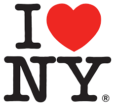

# New York Postcards

## The Goal

As we all know, New York is a pretty amazing place. In this lab we're going to honor the place we can all call home and recreate some NY postcards. You'll be given all of the html and source files that you need but it will be **your** job to write the style rules needed to transform some plain html into a postcard that would make anyone want to move here.

## The Lab
Each section below has a different corresponding html and css file. Any of the html files you preview will be full of un styled pictures or text. You'll be writing the rule sets to make each html element look the way it needs to in order to match the given mockup.

<!--Question: am I writing the selectors and they're writing the rules?  -->
#### Postcard One: Less is More
The first postcard keeps it simple with a logo we all know and love, the classic "I Heart NY". Tourists everywhere will be dying to have your postcard once you can add the correct style rules to iheartny.css in order to make iheartny.html look amazing. A picture of your final product is below, as well as in the iheartny.png file.

